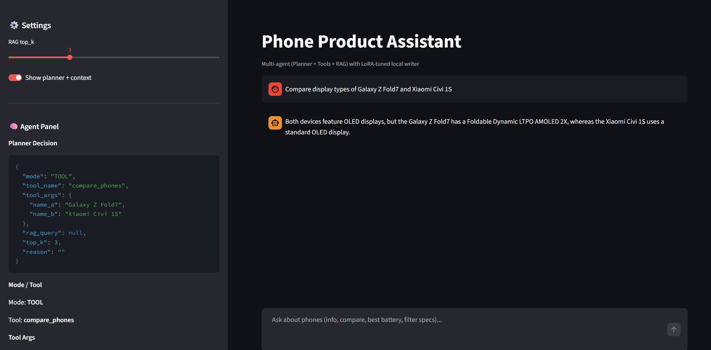
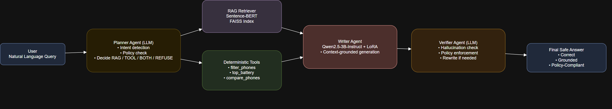
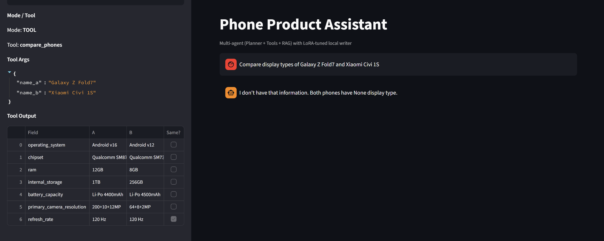

## Multi-Agent Tool-Augmented Phone Product Assistant

A domain-specific intelligent assistant designed to query, compare, filter, and analyze smartphone specifications using modern Large Language Model architectures.

The system integrates Retrieval-Augmented Generation (RAG), deterministic tool execution, multi-agent orchestration, and LoRA fine-tuning to overcome the limitations of standard LLMs such as hallucinations and unreliable arithmetic reasoning.

The project demonstrates a production-grade AI architecture that combines symbolic reasoning with neural language generation to deliver accurate and grounded responses for smartphone specification queries.

---

# Project Architecture

The system consists of four major components

- Retrieval-Augmented Generation (RAG)
- Deterministic Tool Execution Layer
- Multi-Agent Orchestration System
- LoRA Fine-Tuned Language Model

Together these components form a hybrid AI reasoning pipeline capable of both natural language interaction and precise data processing.

---

# Key Features

- Smartphone specification search and analysis
- Device comparison and ranking
- Constraint-based filtering (RAM, battery, chipset, etc.)
- Hybrid reasoning using LLM + deterministic tools
- Multi-agent architecture
- Fine-tuned domain model using LoRA
- Vector search with FAISS
- Interactive interface using Streamlit
- Safety-aware response generation

---

# System Architecture Overview

```
User Query
    ↓
Planner Agent
    ↓
Determines whether to use
• Retrieval (RAG)
• Deterministic tools
• Hybrid reasoning
    ↓
Executor Agent
    ↓
• Retrieves relevant documents
• Executes tools on structured data
    ↓
Writer Agent
Synthesizes context and tool results into a final natural language response
```

---

# Dataset

The system is built on a structured smartphone dataset

```
phones_data_20250729_022344.json
```

The dataset contains detailed attributes including

- Brand
- Model
- Chipset
- RAM  Storage
- Battery capacity
- Display specifications
- Camera configuration

### Data Processing Steps

- Encoding normalization (UTF-8)
- Schema normalization
- Numeric field standardization
- Safe accessors for missing fields

This preprocessing ensures consistent filtering and ranking operations.

---

# Retrieval-Augmented Generation (RAG)

To enable semantic search across device specifications, the system uses a dense vector retrieval architecture.

### Embedding Model

```
sentence-transformersall-MiniLM-L6-v2
```

### Vector Database

```
FAISS (IndexFlatL2)
```

### Retrieval Artifacts

```
phones.index
texts.json
```

Instead of embedding raw JSON, structured attributes are converted into semantic text chunks to reduce noise and improve retrieval quality.

---

# Deterministic Tool Layer

LLMs struggle with precise arithmetic reasoning and structured filtering.

To solve this, the system integrates a tool execution layer.

### Available Tools

#### filter_phones
Filters devices based on constraints.

Example

```
Phones with more than 8GB RAM
```

#### top_battery
Ranks smartphones based on battery capacity.

#### compare_phones
Generates side-by-side specification comparisons.

This hybrid design separates

Symbolic reasoning → handled by code

Natural language generation → handled by the LLM

---

# Multi-Agent System

The assistant uses an agentic workflow to coordinate reasoning steps.

### Planner Agent
- Interprets user intent
- Determines execution strategy
- Selects tools or retrieval

### Executor Agent
- Executes tools
- Retrieves documents from the vector store

### Writer Agent
- Synthesizes final responses
- Ensures clear natural language output

---

# LoRA Fine-Tuning

The base language model used is

```
Qwen2.5-3B-Instruct
```

To align the model with the smartphone domain, Low-Rank Adaptation (LoRA) was applied.

### Benefits

- Parameter-efficient training
- Low GPU requirements
- Faster convergence
- Domain-specific response quality

### Training Script

```
train_lora.py
```

The fine-tuned model improves

- specification formatting
- comparison responses
- safety refusal logic

---

# Deployment

The system is deployed through a Streamlit interface.

Features include

- interactive chat interface
- planner decision telemetry
- retrieved context inspection
- tool execution visibility

This improves debugging, transparency, and user trust.

---

# Evaluation

The system was evaluated on 100 curated test questions covering

- Basic Information
- Device Comparisons
- Filtering Queries
- Ranking Queries
- Safety Queries

### Quantitative Results

 Metric  Count  Percentage 
------------------
 Correct  27  27% 
 Partially Correct  24  24% 
 Wrong  49  49% 
 Total  100  100% 

---

# Interpretation of Results

Although strict exact-match evaluation resulted in 27% strict accuracy, deeper analysis shows strong system performance.

### Strengths

Safety Compliance

The refusal mechanism intentionally avoids hallucinated answers.

Factual Grounding

Correct responses demonstrate accurate retrieval of technical specifications.

Hybrid Reasoning

Tool-augmented responses reliably perform structured filtering and ranking.

---

# Project Structure

```
multi-agent-rag-phone-assistant
│
├── data
│   ├── phones_data.json
│   ├── texts.json
│
├── rag
│   ├── build_index.py
│   ├── phones.index
│
├── tools
│   ├── filter_phones.py
│   ├── compare_phones.py
│   ├── top_battery.py
│
├── agents
│   ├── planner.py
│   ├── executor.py
│   ├── writer.py
│
├── training
│   ├── train_lora.py
│
├── evaluation
│   ├── evaluate.py
│
├── app.py
├── requirements.txt
└── README.md
```

---

# Running the Project

### Install dependencies

```bash
pip install -r requirements.txt
```

### Build the vector index

```bash
python build_index.py
```

### Run the application

```bash
streamlit run app.py
```

---

# Future Improvements

- Improved retrieval ranking
- Expanded smartphone dataset
- Model quantization for faster inference
- Better evaluation metrics
- Integration with external APIs

---

# Conclusion

multi-agent-rag-phone-assistant demonstrates a robust architecture for domain-specific AI assistants. By combining RAG, deterministic tools, LoRA fine-tuning, and multi-agent orchestration, the system achieves strong factual grounding and safety.

The project highlights how modern AI systems can move beyond simple prompting toward structured, reliable, and production-ready architectures.
